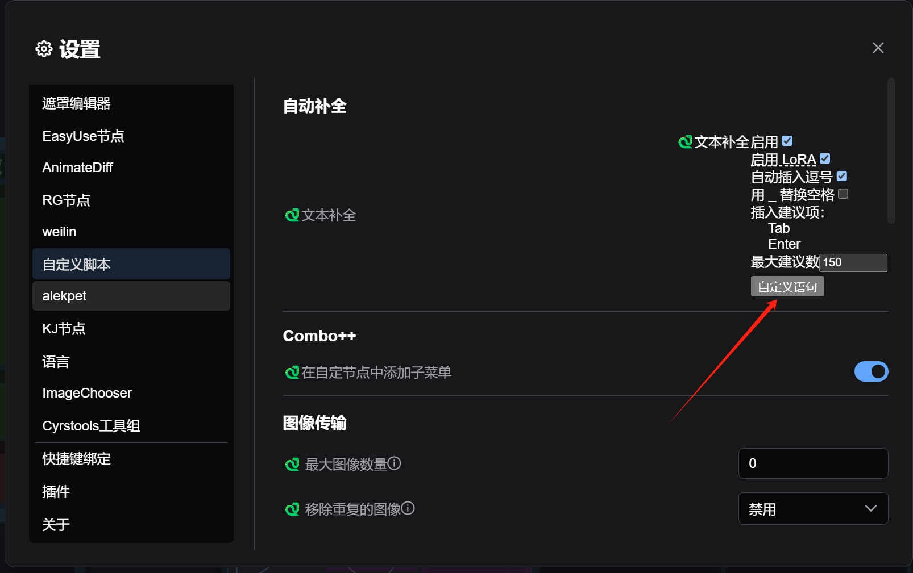
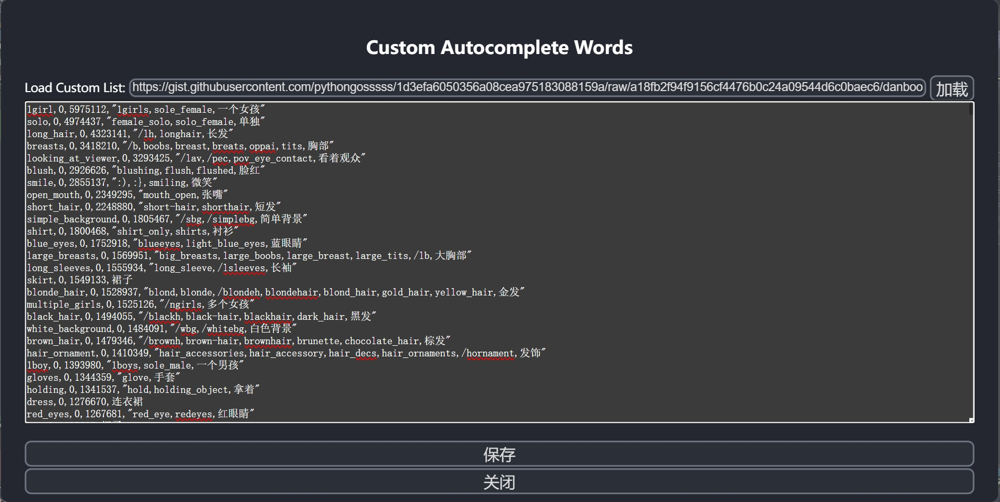
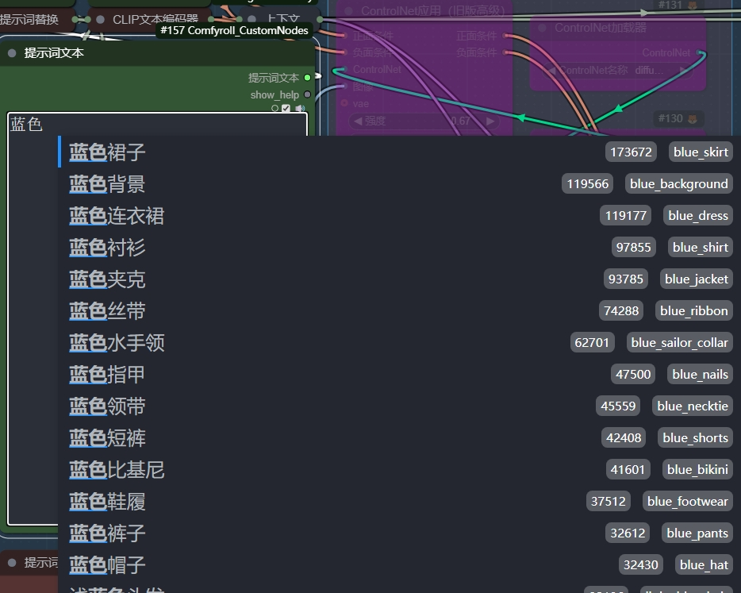

# danbooru-tag-zh
使用deepseek的api对danbooru的词条进行简单的翻译（准确性略低）。原数据来自BetaDoggo的[danbooru-tag-list](https://github.com/BetaDoggo/danbooru-tag-list)
##在comfyui中使用
1.首先你需要安装[ComfyUI-Custom-Scripts](https://github.com/pythongosssss/ComfyUI-Custom-Scripts)。 
2.找到Custom-Scripts的设置选项。

3.清除原来的文本并粘贴txt里的内容，然后保存。

4.如果成功，你应该会看到以下画面。

